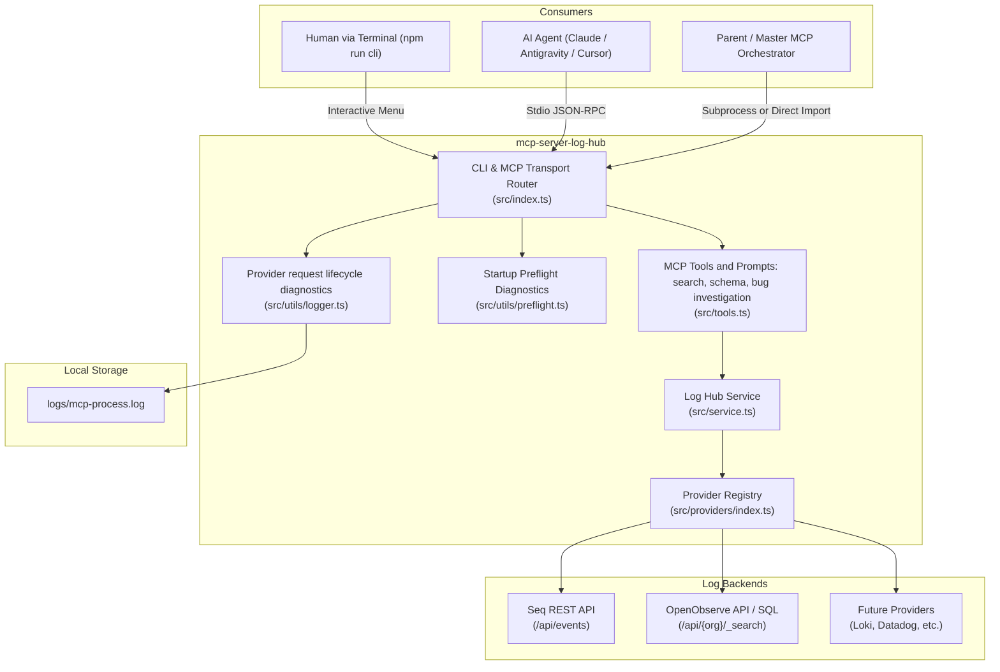

# Architecture & Design Overview

## 1. System Topology

`mcp-server-log-hub` operates as a unified adapter layer bridging AI Agent interfaces and heterogeneous logging platforms.



The `investigate_api_bug` MCP Prompt guides the caller through inspecting source code, discovering Organization/stream/schema, running bounded SELECT searches, saving evidence in the caller's own `log-work/` directory, and citing log timestamps with source locations. Provider request logs record endpoint paths, status, duration, and result counts without credentials, query values, or returned application log contents.

---

## 2. Core Architectural Pillars

### Pillar A: Dual-Mode Operation (Standalone vs Embedded Child)
1. **Standalone MCP Server**:
   - Run directly via `node dist/index.js` or `npx mcp-server-log-hub`.
   - Communicates over standard input/output (`StdioServerTransport`).
2. **Embedded Child Feature Module**:
   - Master MCPs can import `registerLogHubTools` and mount log querying capabilities directly into the master server without subprocess overhead.

### Pillar B: Stdio Transport Integrity
In the Model Context Protocol, any data written to standard output (`stdout`) that is not valid JSON-RPC breaks the client connection.
- **Rule**: `process.stdout` is exclusively reserved for `@modelcontextprotocol/sdk`.
- **Diagnostics & Errors**: Routed to `process.stderr` and appended to `logs/mcp-process.log`.
- **Interactive UI**: Only rendered when explicitly started in CLI mode (`--cli`).

### Pillar C: Provider Adapter Pattern
Every log backend implements the common `LogProvider` interface:
```typescript
export interface LogProvider {
  readonly name: string;
  getStatus(): ProviderStatus;
  queryLogs(params: LogQuery): Promise<LogEntry[]>;
}
```
Each provider encapsulates its own authentication, endpoint URL structure, and native query format. OpenObserve also discovers accessible Organizations and log streams.

---

## 3. Environment Portability
- All file paths (logs, configurations) are computed using `new URL('..', import.meta.url)` and `node:path.resolve`.
- No operating system-specific path separators or drive letters are hardcoded.
- Runs identically on Windows (PowerShell/CMD), Linux, macOS, and containerized Docker environments.
